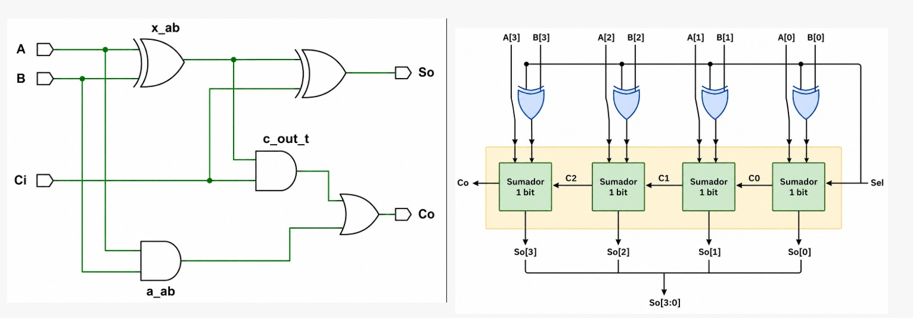
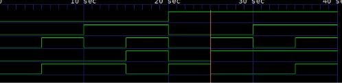
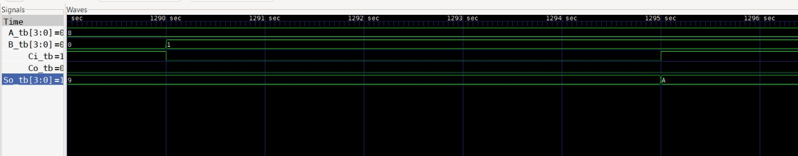

# Lab01 - Sumador/Restador de 4 bits

## Integrantes

* [Juan Diego Cervantes Guio](https://github.com/juandicervantesgu-dev)
* [Juan Sebastian Guerrero Gualteros](https://github.com/juanseguerrerogu07)
* [Samuel Esteban Jaime Gutierrez](https://github.com/Samueljgest) 


### Índice

1. [Fundamentos teóricos](#fundamentos-teóricos)
2. [Documentación del diseño](#documentación-del-diseño)
3. [Diagramas](#diagramas)
4. [Evidencias de implementación](#evidencias-de-implementación)
5. [Conclusiones](#conclusiones)
6. [Referencias](#referencias)
# Fundamentos teóricos

## ¿Qué es un bit?

Un **bit** (*Binary Digit*) es la unidad más pequeña de información utilizada en los sistemas digitales.

Un bit solamente puede tomar dos valores:

* `0` → Estado lógico bajo.
* `1` → Estado lógico alto.

Al combinar varios bits podemos representar una mayor cantidad de números.

Por ejemplo, con **4 bits** tenemos:

```text
0000 → 0
0001 → 1
0010 → 2
...
1111 → 15
```

En total existen:

```text
2^4 = 16 combinaciones
```

## ¿Qué es un byte?

Un **byte** corresponde a un conjunto de **8 bits**.

```text
1 Byte = 8 bits
```

También podemos encontrar:

* *4 bits* = 1 nibble.
* *8 bits* = 1 byte.
* *16 bits* = 2 bytes.
* *32 bits* = 4 bytes.

En este laboratorio trabajamos principalmente con números de **4 bits**.
Ahora se abordara sobre el sistema binario, factor muy importante para la descripción e implementación de hardware en Quartus.

Únicamente utiliza:

```text
0 y 1
```

Cada posición tiene un valor correspondiente a una potencia de 2.

Por ejemplo:
| **Concepto** | **Bit 3** | **Bit 2** | **Bit 1** | **Bit 0** |
|:---:|:---:|:---:|:---:|:---:|
| **Binario** | 1 | 0 | 1 | 1 |
| **Posición** | 3 | 2 | 1 | 0 |
| **Valor** | 8 | 4 | 2 | 1 |
Entonces:

```text
1011₂ = 8 + 0 + 2 + 1

1011₂ = 11₁₀
```

## Suma binaria

La **suma binaria** funciona de manera similar a la suma decimal, pero solamente utiliza `0` y `1`.

Las operaciones básicas son:
| **A** | **B** | **Suma** | **Acarreo** |
|:-----:|:-----:|:--------:|:-----------:|
|   0   |   0   |    0     |      0      |
|   0   |   1   |    1     |      0      |
|   1   |   0   |    1     |      0      |
|   1   |   1   |    0     |      1      |

La operación más importante es:

```text
1 + 1 = 10₂
```

El `0` corresponde al resultado de la posición actual y el `1` corresponde al **acarreo**.

## ¿Qué es el acarreo?

El **acarreo** (*Carry*) aparece cuando el resultado de una suma necesita un bit adicional.

Por ejemplo:

```text
  1
+ 1
---
 10
```

En el laboratorio utilizamos:

* `Ci` → **Carry In** → Acarreo de entrada.
* `Co` → **Carry Out** → Acarreo de salida.

---

# Documentación del diseño

## 1. Sumador de 1 bit

### 1.1 Descripción

El **sumador completo de 1 bit** permite sumar tres valores:

```text
A + B + Ci
```

Sus entradas son:

* `A` → Primer bit.
* `B` → Segundo bit.
* `Ci` → Acarreo de entrada.

Sus salidas son:

* `S` → Resultado de la suma.
* `Co` → Acarreo de salida.

La expresión correspondiente a la suma es:

```text
S = A XOR B XOR Ci
```

### 1.2 Código Verilog

El circuito fue desarrollado utilizando **primitivas de Verilog**, específicamente compuertas `XOR`, `AND` y `OR`.

```verilog
module sumador1b(
    input A,
    input B,
    input Ci,
    output S,
    output Co
);

    wire res;
    wire res2;
    wire res3;
    wire res4;

    xor (res, B, Ci);
    xor (S, res, A);

    and (res2, A, Ci);
    or  (res3, A, Ci);
    and (res4, B, res3);
    or  (Co, res4, res2);

endmodule
```

### 1.3 Diagramas
A continuación, se evidenciara los esquematicos implementados para realizar el laboratorio usando la logica digital y compuertas.


### **Selección de operación**

La entrada **`sel`** funciona como una señal de control que determina la operación que realizará el circuito.

> **`sel = 0` — SUMA**
>
> El circuito mantiene el valor original de `B` y realiza:
>
> ```text
> A + B
> ```

> **`sel = 1` — RESTA**
>
> El circuito obtiene el complemento a 2 de `B` y realiza:
>
> ```text
> A + (~B) + 1
> ```

| **Señal `sel`** | **Operación** | **Valor de B** | **Ci** | **Resultado** |
|:---:|:---:|:---:|:---:|:---:|
| `0` | **SUMA** | `B` | `0` | `A + B` |
| `1` | **RESTA** | `~B` | `1` | `A + (~B) + 1` |

---

> **Nota importante**
>
> Durante la resta, el circuito aprovecha el **complemento a 2** para convertir la operación de resta en una suma:
>
> **`A - B = A + (~B) + 1`**
>
> De esta manera, el mismo sumador de 4 bits puede utilizarse tanto para **sumar** como para **restar**.
### Evidencias de implementación
--- 
Por consiguiente, tenemos las evidencias de implementación. 

---
*Simulación del sumador de 1 bit* 

---

--- 
*Simulación del sumador de 4 bits*

--- 
En este apartado observamos las evidencias de implementación ya con el programa subido en la _FPGA_, luego de haber realizado su debida prueba en el *Test Bench* presione a continuación el enlace para abrir un video de Youtube: 
- Ejercicio de 1 bit: https://youtube.com/shorts/UTjLHe9uQ_I?feature=share
- Ejercicio Sumador 4 Bits: https://youtube.com/shorts/g03-NLE0gDQ?feature=share
- Ejercicio Sumador restador: https://youtube.com/shorts/3y13669jg1g?feature=share
- - - 
# Conclusiones

* Se comprendió el funcionamiento de la **suma binaria** y la generación de acarreos.

* Se desarrolló un **sumador completo de 1 bit** utilizando primitivas de Verilog.

* Mediante la **instanciación** de cuatro sumadores de 1 bit se construyó un **sumador de 4 bits**.

* Se comprendió que el **complemento a 1** consiste en invertir todos los bits de un número.

* Se determinó que el **complemento a 2** se obtiene sumando `1` al complemento a 1.

* Se utilizó la expresión `A + ~B + 1` para realizar la operación de resta utilizando un circuito sumador.

* La señal `sel` permite seleccionar entre las operaciones de **suma y resta**.

* La simulación permite comprobar el funcionamiento del circuito antes de realizar su implementación en la **FPGA MAX 10**.

---

# Referencias

* **Universidad ECCI.** *Arquitectura de Procesadores - Lab 01: Sumador de 1 bit y sumador de 4 bits*.
* Material suministrado durante las sesiones de **Arquitectura de Procesadores**.
* Documentación de **Verilog HDL**.
