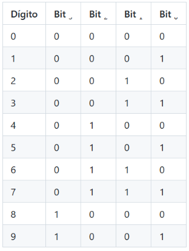
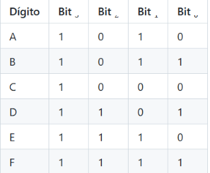
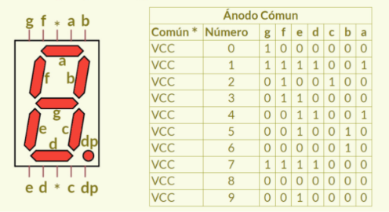
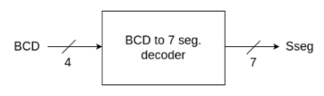
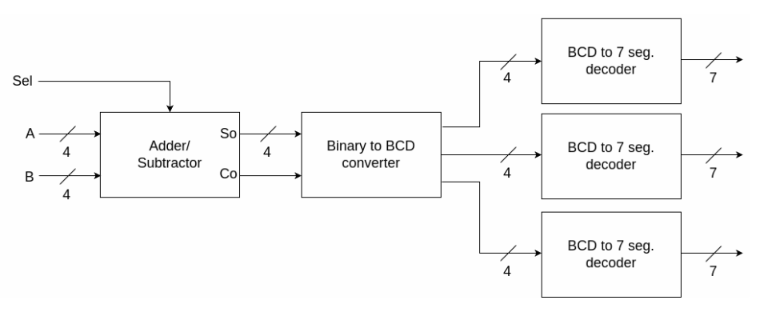
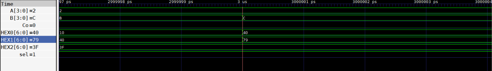
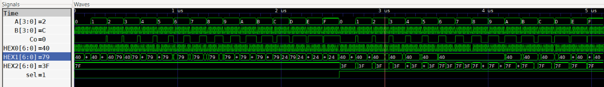
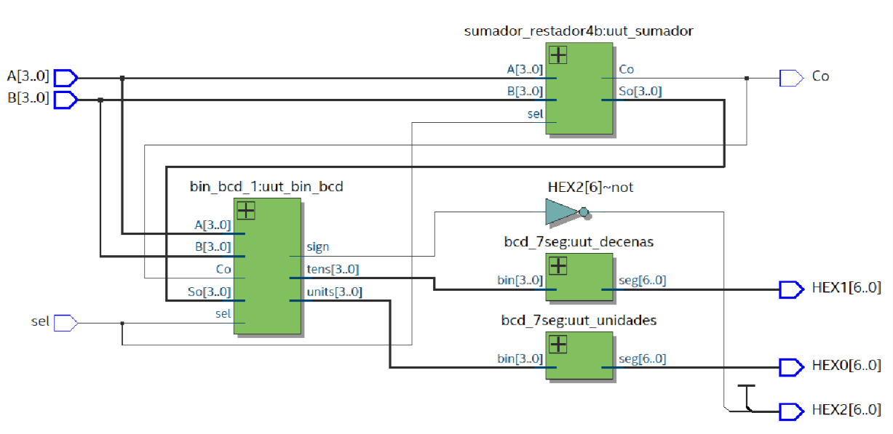

# Lab02 - Sumador/Restador de 4 bits

## Integrantes

* [Juan Diego Cervantes Guio](https://github.com/juandicervantesgu-dev)
* [Juan Sebastian Guerrero Gualteros](https://github.com/juanseguerrerogu07)
* [Samuel Esteban Jaime Gutierrez](https://github.com/Samueljgest) 


### Índice

1. [Fundamentos teóricos](#fundamentos-teóricos)
2. [Documentación del diseño](#documentación-del-diseño)
3. [Diagramas](#diagramas)
4. [Implementación en Verilog](#implementación-en-verilog)
5. [Evidencias de implementación](#evidencias-de-implementación)
6. [Conclusiones](#conclusiones)
7. [Referencias](#referencias)


# Fundamentos teóricos

**1. *Sistemas binarios***

Los **sistemas digitales** trabajan principalmente con información representada mediante números binarios. A diferencia del sistema decimal, que utiliza diez símbolos del 0 al 9, el sistema binario utiliza únicamente dos valores:

**0: nivel lógico bajo.**
**1: nivel lógico alto.**

Cada posición de un número binario representa una potencia de dos.

Por ejemplo:

1011₂

Su equivalente decimal se obtiene de la siguiente manera:

1×2³ + 0×2² + 1×2¹ + 1×2⁰
8 + 0 + 2 + 1 = 11

Por lo tanto: 1011₂ = 11₁₀


--- 
*En circuitos digitales, cada dígito binario se denomina bit. Cuando se agrupan varios bits es posible representar cantidades mayores y realizar operaciones aritméticas directamente mediante circuitos lógicos.*

**2. Suma binaria**

La suma binaria sigue reglas similares a la suma decimal, pero utiliza únicamente los valores 0 y 1.

Las operaciones básicas son:

A	B	Suma	Acarreo
0	0	0	0
0	1	1	0
1	0	1	0
1	1	0	1

Cuando se suman tres bits, incluyendo un acarreo de entrada, se utiliza un sumador completo.

**3. Sumador completo de 1 bit**

Un sumador completo o Full Adder es un circuito combinacional que permite sumar tres entradas binarias:

A
B
Cin: acarreo de entrada

Y genera dos salidas:

S: resultado de la suma.
Cout: acarreo de salida.

La ecuación de la suma es:

S = A ⊕ B ⊕ Cin 

Mientras que el acarreo puede obtenerse mediante:

Cout = (A · B) + (Cin · (A ⊕ B))

La tabla de verdad correspondiente es:

A	B	Cin	S	Cout
0	0	0	0	0
0	0	1	1	0
0	1	0	1	0
0	1	1	0	1
1	0	0	1	0
1	0	1	0	1
1	1	0	0	1
1	1	1	1	1

- - -


**4. Sumador de 4 bits**

Para realizar operaciones entre números de cuatro bits se pueden conectar cuatro sumadores completos de 1 bit.

Cada etapa recibe el acarreo generado por la etapa anterior.

Para:

A = A3 A2 A1 A0
B = B3 B2 B1 B0

la operación puede visualizarse como:

        A3 A2 A1 A0
      + B3 B2 B1 B0
      -------------
   Cout S3 S2 S1 S0

Debido a que la suma máxima de dos números de cuatro bits es:

1111₂ + 1111₂

equivalente a:

15 + 15 = 30

*se requieren cinco bits para representar completamente el resultado.*

30₁₀ = 11110₂

Por esta razón, el resultado final puede construirse concatenando el acarreo final con los cuatro bits correspondientes a la suma.

{Cout, S}

**5. Resta binaria**

*Una resta binaria puede implementarse mediante un circuito sumador utilizando el complemento del segundo operando

***En lugar de construir un circuito completamente diferente para la resta, puede aprovecharse el mismo sumador de cuatro bits.***

La expresión convencional es:

A - B

Esta operación puede escribirse mediante complemento a dos como:

A + complemento_a_2(B)

**6. Complemento a uno**

El complemento a uno de un número binario se obtiene invirtiendo cada uno de sus bits.

Ejemplo:

B = 0101

Complemento a uno:

~B = 1010

En términos de compuertas digitales, esta operación se realiza mediante compuertas NOT.

**7. Complemento a dos**

El complemento a dos se obtiene realizando dos operaciones:

Invertir todos los bits del número.
Sumar 1 al resultado.

Por ejemplo:

B = 0101

Complemento a uno:

1010

Sumando uno:

1010
+0001
-----
1011

Por lo tanto:

Complemento a 2 de 0101 = 1011

Gracias a este método es posible utilizar el mismo circuito sumador para realizar operaciones de resta.

**8. Sumador/Restador**

El circuito desarrollado permite seleccionar entre suma y resta utilizando una señal de control.

Se define una entrada denominada:

**sel**

Su funcionamiento es:

sel	Operación
0	Suma
1	Resta

Cuando:

**sel = 0**

el número B pasa sin modificaciones al circuito.

Cuando:

**sel = 1**

los bits de B deben invertirse y se utiliza un acarreo inicial igual a 1.

Esto permite ejecutar:

A + (~B) + 1

que corresponde al complemento a dos utilizado para realizar:

A - B
9. Compuerta XOR como selector

La compuerta XOR permite controlar fácilmente la inversión del operando B.

Su tabla de verdad es:

**B	sel	Salida
**0	0	0**
**1	0	1**
**0	1	1**
**1	1	0**

Cuando:

sel = 0

se obtiene:

*B XOR 0 = B*

Por lo tanto, se realiza una suma normal.

Cuando:

**sel = 1**

se obtiene:

**B XOR 1 = ~B**

permitiendo generar el complemento a uno de B.

Adicionalmente:

***Cin inicial = sel***

Por esta razón, cuando sel = 1, también se suma automáticamente el 1 necesario para obtener el complemento a dos.

# Documentación del diseño
El propósito del laboratorio es implementar un circuito digital capaz de realizar operaciones de suma y resta entre dos números binarios de cuatro bits.

Las entradas principales son:

A[3:0]
B[3:0]
sel

El circuito debe seleccionar la operación mediante sel.

sel = 0 → A + B
sel = 1 → A - B

El diseño se construyó utilizando módulos básicos y lógica combinacional, buscando representar directamente la estructura de hardware correspondiente.

**2. Organización modular**

Para facilitar el diseño, el sistema puede dividirse en diferentes niveles.

Módulo sumador completo de 1 bit

Es el bloque fundamental.

Entradas:

A
B
Cin

Salidas:

S
Cout

Su función consiste en sumar dos bits y el acarreo proveniente de la posición anterior.

Módulo sumador/restador de 4 bits

El módulo principal utiliza cuatro bloques de suma conectados en cascada.

Las señales de acarreo se propagan de una etapa a otra:

C0 → C1 → C2 → C3 → Cout

El primer acarreo está determinado por la señal de selección:

C0 = sel

De esta manera:

sel = 0 → Cin = 0
sel = 1 → Cin = 1

**3. Preparación del operando B**

Cada bit del operando B pasa por una compuerta XOR junto con la señal sel.

Por ejemplo:

B0_mod = B0 XOR sel
B1_mod = B1 XOR sel
B2_mod = B2 XOR sel
B3_mod = B3 XOR sel

Cuando se realiza una suma:

sel = 0

entonces:

B_mod = B

Cuando se realiza una resta:

sel = 1

entonces:

B_mod = ~B

y el acarreo inicial introduce el +1 correspondiente al complemento a dos.

**4. Propagación del acarreo**

Los cuatro sumadores están conectados mediante una arquitectura denominada Ripple Carry Adder.

El funcionamiento es:

FA0 → FA1 → FA2 → FA3

Cada sumador genera un acarreo que se convierte en la entrada del siguiente.

De manera simplificada:

FA0:
A0 + B0 + C0 → S0, C1

FA1:
A1 + B1 + C1 → S1, C2

FA2:
A2 + B2 + C2 → S2, C3

FA3:
A3 + B3 + C3 → S3, Cout

**5. Resultado de la operación**

El resultado de la operación se obtiene mediante:

S[3:0]

junto con el acarreo final:

Cout

Para las operaciones que requieren representar cinco bits, puede utilizarse la concatenación:

{Cout, S}

De esta manera, el circuito puede representar correctamente resultados de suma comprendidos entre:

0 y 30
--- 
**6. *Ejemplo de suma***

Supóngase:

A = 0101 = 5
B = 0011 = 3
sel = 0

Como sel = 0, se realiza suma:

  0101
+ 0011
------
  1000

Por lo tanto:

5 + 3 = 8
7. Ejemplo de resta

Supóngase:

A = 0111 = 7
B = 0011 = 3
sel = 1

Primero se obtiene el complemento a uno de B:

B  = 0011
~B = 1100

Luego se suma uno:

1100 + 0001 = 1101

Finalmente:

  0111
+ 1101
------
1 0100

Los cuatro bits inferiores representan:

0100 = 4

Por lo tanto:

7 - 3 = 4

# Diagramas

**1.BBCD (Binary Coded Decimal)**


BCD significa Décimal Codificado en Binario y representa el sistema de numeración digital en el que podemos representar cada número décimal utilizando 4 bits de números binarios.

Como sabemos hay 10 dígitos en el sistema décimal, para representarlos necesitamos 10 combinaciones de 4 bits binarios.



Ahora bien, también es posible representar de forma binaria los números décimales del 10 al 15 pero empleando su correspondiente representación en el sistema hexadécimal


**2.Display de 7 segmentos**

El display de siete segmentos es un dispositivo electrónico que consta de siete diodos emisores de luz (LED) dispuestos en un patrón definido; encender una combinación particular de éstos permite representar un dígito décimal o hexadécimal Existen dos tipos de display LED de siete segmentos:

Tipo de ánodo común: en este tipo de display, todos los ánodos de los siete LEDs están conectados a +Vcc (por lo tanto, ánodo común) y el LED muestra dígitos cuando se suministra un nivel al bajo a los cátodos individuales.



**Primera parte: Diseño BCD a 7seg**

Realizar el diseño, sintentización e implementación del display de 
7 segmentos, que permita visualizar números en representación hexadécimal en uno de los displays de la tarjeta de desarrollo.

Pasos a seguir:

Definir el bloque funcional del diseño:



Como se evidencia, el bloque tiene un puerto de entrada llamado BCD de 4 bits y un puerto de salida llamado Sseg de 7 bits, lo que concuerda con lo mencionado anteriormente.

2.Definir la descripción funcional del diseño: Tablas de verdad.

3.Describir usando HDL el comportamiento del diseño.

4.Simular el diseño: Implemente un testbench para este fin.

5.Implementación: en la tarjeta correspondiente implemente y valide el funcionamiento.

**Segunda parte: Visualización dinámica en 3 displays de 7 segmentos**




# Implementación en Verilog

Esta sección explica el código Verilog módulo por módulo, y dentro de cada módulo, bloque por bloque, en el mismo orden jerárquico que se presentó en *Documentación del diseño*: `sumador1b` → `sumador4b` → `sumador_restador4b` → `bin_bcd_1` → `bcd_7seg` → `top_display`.

## 1. Sumador completo de 1 bit (`sumador1b`)

Es el bloque fundamental del diseño: implementa el Full Adder de la sección de fundamentos usando compuertas primitivas de Verilog (`xor`, `and`, `or`) en lugar de asignaciones continuas, para reflejar directamente la estructura de hardware.

**Puertos del módulo**

```verilog
module sumador1b(
    input  A,
    input  B,
    input  Ci,
    output S,
    output Co
);
```

Tres entradas de 1 bit (`A`, `B`, el acarreo de entrada `Ci`) y dos salidas de 1 bit (`S`, `Co`), tal como se definió en la tabla de verdad del Full Adder.

**Señales internas**

```verilog
    wire w1;
    wire w2;
    wire w3;
```

Tres cables auxiliares que van a guardar cada uno de los tres términos AND de la ecuación del acarreo.

**Cálculo de la suma**

```verilog
    xor (S, A, B, Ci);
```

Una sola compuerta XOR de tres entradas calcula directamente `S = A ⊕ B ⊕ Cin`.

**Cálculo del acarreo**

```verilog
    and (w1, A, B);
    and (w2, A, Ci);
    and (w3, B, Ci);

    or (Co, w1, w2, w3);
```

`w1`, `w2` y `w3` son los tres productos de la ecuación `Cout = (A·B) + (A·Cin) + (B·Cin)`; la compuerta `or` final los combina para producir `Co`. Este bloque se instancia cuatro veces dentro de `sumador4b`.

## 2. Sumador de 4 bits (`sumador4b`)

Conecta cuatro `sumador1b` en cascada (Ripple Carry Adder), donde el acarreo de salida de cada etapa alimenta el acarreo de entrada de la siguiente.

**Puertos del módulo**

```verilog
module sumador4b(
    input  [3:0] A,
    input  [3:0] B,
    input        Ci,
    output [3:0] So,
    output       Co
);
```

Ahora `A`, `B` y `So` ya son buses de 4 bits; `Ci` sigue siendo el acarreo inicial y `Co` el acarreo final del sumador completo.

**Acarreos internos**

```verilog
    wire c1;
    wire c2;
    wire c3;
```

Son los tres acarreos intermedios de la cadena `C0 → C1 → C2 → C3 → Cout` descrita en "Propagación del acarreo".

**Primera etapa (bit 0)**

```verilog
    sumador1b FA0(
        .A(A[0]),
        .B(B[0]),
        .Ci(Ci),
        .S(So[0]),
        .Co(c1)
    );
```

`FA0` toma el acarreo inicial `Ci` (que viene determinado por `sel` en el módulo superior) y genera `So[0]` junto con el acarreo `c1` hacia la siguiente etapa.

**Etapas intermedias (bits 1 y 2)**

```verilog
    sumador1b FA1(
        .A(A[1]),
        .B(B[1]),
        .Ci(c1),
        .S(So[1]),
        .Co(c2)
    );

    sumador1b FA2(
        .A(A[2]),
        .B(B[2]),
        .Ci(c2),
        .S(So[2]),
        .Co(c3)
    );
```

Cada etapa recibe el acarreo de la anterior (`c1`, `c2`) y produce el siguiente (`c2`, `c3`), exactamente como en la fila de la tabla `Ax + Bx + Cx → Sx, Cx+1`.

**Última etapa (bit 3)**

```verilog
    sumador1b FA3(
        .A(A[3]),
        .B(B[3]),
        .Ci(c3),
        .S(So[3]),
        .Co(Co)
    );

endmodule
```

`FA3` cierra la cadena: su salida de acarreo ya no es un cable interno, sino la salida `Co` del módulo completo, que luego se usa para formar el resultado de 5 bits `{Co, So}`.

## 3. Sumador/Restador de 4 bits (`sumador_restador4b`)

Agrega la capacidad de resta reutilizando `sumador4b`, aplicando la técnica de complemento a dos: invertir `B` con XOR cuando `sel = 1` y usar `sel` como acarreo inicial.

**Puertos del módulo**

```verilog
module sumador_restador4b(
    input  [3:0] A,
    input  [3:0] B,
    input        sel,
    output [3:0] So,
    output       Co
);
```

Se agrega la entrada `sel` frente a `sumador4b`: es la señal de control que decide si el circuito suma o resta.

**Preparación de B**

```verilog
    wire [3:0] B_xor;

    xor (B_xor[0], B[0], sel);
    xor (B_xor[1], B[1], sel);
    xor (B_xor[2], B[2], sel);
    xor (B_xor[3], B[3], sel);
```

Cada bit de `B` pasa por una compuerta XOR con `sel`. Esto es exactamente lo explicado en "Preparación del operando B": si `sel = 0`, `B_xor = B` (suma normal); si `sel = 1`, `B_xor = ~B` (primer paso del complemento a dos).

**Reutilización del sumador**

```verilog
    sumador4b SR(
        .A(A),
        .B(B_xor),
        .Ci(sel),
        .So(So),
        .Co(Co)
    );

endmodule
```

`sel` se conecta directamente como `Ci`, aportando el `+1` que completa el complemento a dos al restar. El circuito nunca necesita un restador aparte: `sumador4b` (aquí instanciado como `SR`) hace todo el trabajo, tal como se explica en la sección "Sumador/Restador".

## 4. Conversión binario → BCD con signo (`bin_bcd_1`)

Traduce el resultado crudo del sumador/restador (`So`, `Co`) a un formato mostrable en displays decimales: un bit de signo, decenas y unidades en BCD, usando el algoritmo **Double Dabble** (shift-and-add-3).

**Puertos y registros**

```verilog
module bin_bcd_1(
    input  [3:0] A,
    input  [3:0] B,
    input        sel,
    input  [3:0] So,
    input        Co,
    output reg       sign,
    output reg [3:0] tens,
    output reg [3:0] units
);
    reg [4:0] magnitude;
    reg [7:0] shift_reg;   // solo 8 bits: decenas | unidades
    integer i;
```

Además de `So` y `Co`, este módulo también necesita `A`, `B` y `sel` como entradas, porque el signo del resultado depende de comparar `A` con `B` directamente. `magnitude` guarda el valor absoluto en binario (5 bits, 0–30) y `shift_reg` es el registro de trabajo del Double Dabble (byte alto = decenas, byte bajo = unidades).

**Cálculo del signo**

```verilog
    always @(*) begin
        if (sel && (A < B))
            sign = 1'b1;
        else
            sign = 1'b0;
```

Solo puede haber resultado negativo si se está restando (`sel = 1`) y además `A < B`; en ese caso `sign = 1` y más adelante se enciende el signo "-" en `HEX2`.

**Cálculo de la magnitud**

```verilog
        if (sign) begin
            // A < B (resta negativa)
            // Magnitud = B - A
            magnitude = {1'b0, B} - {1'b0, A};
        end
        else if (sel) begin
            // Resta con A >= B: Co siempre es 1 (indica "sin préstamo"),
            // no es parte del resultado -> se descarta
            magnitude = {1'b0, So};
        end
        else begin
            // Suma: aquí sí importa el acarreo real
            magnitude = {Co, So};
        end
```

Tres casos distintos:
- Resultado negativo → se recalcula directamente `B - A` (ya en positivo), en vez de usar el complemento a dos que entregó `sumador_restador4b`.
- Resta sin resultado negativo → se descarta `Co` (en complemento a dos solo indica "no hubo préstamo", no aporta valor) y se usa únicamente `So`.
- Suma → sí se conserva el `Co` real como bit más significativo, porque ahí representa una unidad de valor 16 (recordar el ejemplo 15+15=30 de la sección de fundamentos, que necesita 5 bits).

**Algoritmo Double Dabble**

```verilog
        shift_reg = 8'b0;
        for (i = 4; i >= 0; i = i - 1) begin
            // Decenas
            if (shift_reg[7:4] >= 5)
                shift_reg[7:4] = shift_reg[7:4] + 3;
            // Unidades
            if (shift_reg[3:0] >= 5)
                shift_reg[3:0] = shift_reg[3:0] + 3;
            // Shift
            shift_reg = {shift_reg[6:0], magnitude[i]};
        end
```

El bucle recorre los 5 bits de `magnitude` de más significativo a menos significativo. Antes de cada corrimiento (`shift`), si el nibble de decenas o el de unidades ya vale 5 o más, se le suma 3 (esto evita que un nibble BCD llegue a representar más de 9 al seguir desplazando bits). Después de las 5 iteraciones, `shift_reg` contiene el número ya codificado en BCD.

**Salidas**

```verilog
        tens  = shift_reg[7:4];
        units = shift_reg[3:0];
    end
endmodule
```

El nibble alto de `shift_reg` queda como decenas y el nibble bajo como unidades — el rango 0–30 de la documentación cabe exactamente en estos dos dígitos.

## 5. Decodificador BCD a 7 segmentos (`bcd_7seg`)

Convierte un dígito BCD (0–9) en el patrón de segmentos para un display de **ánodo común** (segmento encendido = 0 lógico), como se explicó en la sección de Diagramas.

**Puertos del módulo**

```verilog
module bcd_7seg(
    input [3:0] bin,
    output reg [6:0] seg
);
```

`bin` es el dígito BCD de entrada (0–9) y `seg` son los 7 bits de salida, uno por cada segmento (a–g) del display.

**Tabla de decodificación**

```verilog
    always @(*) begin
        case(bin)
            4'h0: seg = 7'b1000000;
            4'h1: seg = 7'b1111001;
            4'h2: seg = 7'b0100100;
            4'h3: seg = 7'b0110000;
            4'h4: seg = 7'b0011001;
            4'h5: seg = 7'b0010010;
            4'h6: seg = 7'b0000010;
            4'h7: seg = 7'b1111000;
            4'h8: seg = 7'b0000000;
            4'h9: seg = 7'b0010000;
            default: seg = 7'b1111111;
        endcase
    end
endmodule
```

Cada línea del `case` es la fila de la tabla de verdad de un dígito. Como el display es de ánodo común, un `0` en un bit **enciende** ese segmento y un `1` lo **apaga**; por ejemplo, `4'h0` enciende todos los segmentos excepto el central (`g`), dibujando el "0". El caso `default` apaga todos los segmentos (`7'b1111111`) y protege ante valores BCD fuera de 0–9 (por ejemplo, si llegaran dígitos hexadecimales A–F, que no tienen sentido en un display decimal).

## 6. Módulo de nivel superior (`top_display`)

Integra todo el sistema: conecta el sumador/restador, la conversión a BCD con signo y los tres decodificadores de 7 segmentos (unidades, decenas y signo). Es el módulo que se configura como **Top-Level Entity** en Quartus.

**Puertos del módulo**

```verilog
module top_display(
    input  [3:0] A,
    input  [3:0] B,
    input        sel,

    output       Co,

    output [6:0] HEX0,
    output [6:0] HEX1,
    output [6:0] HEX2
);

    wire [3:0] So;

    wire       sign;
    wire [3:0] tens;
    wire [3:0] units;
```

`A`, `B` y `sel` son las entradas físicas (switches de la tarjeta); `HEX0`, `HEX1` y `HEX2` son los tres displays de salida. `So`, `sign`, `tens` y `units` son cables internos que conectan los submódulos entre sí.

**Sumador/restador**

```verilog
    sumador_restador4b uut_sumador(
        .A(A),
        .B(B),
        .sel(sel),
        .So(So),
        .Co(Co)
    );
```

Produce el resultado crudo (`So`, `Co`) a partir de las entradas del usuario.

**Conversión binario → BCD**

```verilog
    bin_bcd_1 uut_bin_bcd(
        .A(A),
        .B(B),
        .sel(sel),
        .So(So),
        .Co(Co),
        .sign(sign),
        .tens(tens),
        .units(units)
    );
```

Toma ese resultado crudo y lo traduce a `sign`, `tens` y `units`, listos para mostrarse.

**Decodificadores de decenas y unidades**

```verilog
    bcd_7seg uut_decenas(
        .bin(tens),
        .seg(HEX1)
    );

    bcd_7seg uut_unidades(
        .bin(units),
        .seg(HEX0)
    );
```

Dos instancias del mismo `bcd_7seg`: una convierte `tens` para `HEX1` y otra convierte `units` para `HEX0`.

**Display de signo**

```verilog
    // Ánodo común:
    // 0 = segmento encendido
    // 1 = segmento apagado
    //
    // HEX2[6] = segmento g
    //
    // 0111111:
    // g = 0 -> ENCENDIDO
    // demás = 1 -> APAGADOS
    //
    // Esto muestra "-"

    assign HEX2 = sign ? 7'b0111111 : 7'b1111111;

endmodule
```

`HEX2` no usa `bcd_7seg`: se controla con un `assign` directo, encendiendo únicamente el segmento central (`g`) para dibujar el signo "-" cuando `sign = 1`, o apagando todo el display cuando el resultado es positivo.

# Evidencias de implementación

## 1. Formas de onda de simulación

En estas capturas se observa el comportamiento del testbench sobre `top_display` (o sobre los módulos que se hayan probado por separado), permitiendo verificar que, para cada combinación de `A`, `B` y `sel`, las señales `So`, `Co`, `sign`, `tens` y `units` cambian según lo esperado según los ejemplos calculados a mano en la sección de fundamentos.







## 2. RTL Viewer

Esta vista, generada por Quartus a partir del código Verilog, permite confirmar visualmente que la síntesis respeta la jerarquía de módulos diseñada: `top_display` instanciando a `sumador_restador4b` (que a su vez usa `sumador4b` y, dentro de este, cuatro `sumador1b`), junto con `bin_bcd_1` y los dos `bcd_7seg`.




## 3. Implementación física en la tarjeta


# Conclusiones


# Referencias 
**[1]** M. M. Mano y M. D. Ciletti, Digital Design: With an Introduction to the Verilog HDL, VHDL, and SystemVerilog, 6th ed. Pearson, 2018.

**[2]** S. Brown y Z. Vranesic, Fundamentals of Digital Logic with Verilog Design, 3rd ed. McGraw-Hill Education, 2014.

**[3]** D. M. Harris y S. L. Harris, Digital Design and Computer Architecture, 2nd ed. Morgan Kaufmann, 2012.

**[4]** IEEE, IEEE Standard for Verilog Hardware Description Language, IEEE Std 1364.

**[5]** Intel Corporation, Quartus Prime Software Documentation, Intel FPGA.

**[6]** Icarus Verilog, Icarus Verilog Documentation, documentación de simulación y compilación de diseños Verilog HDL.