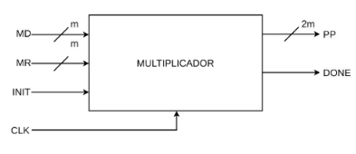
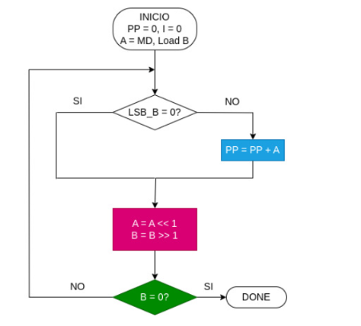
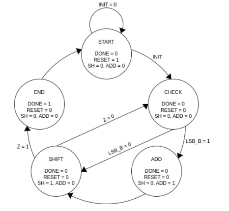
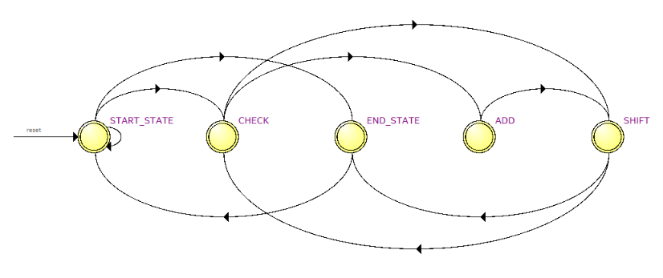

# Lab03: Multiplicador de 3 bits usando Máquina de Estados

## Integrantes

* [Juan Diego Cervantes Guio](https://github.com/juandicervantesgu-dev)
* [Juan Sebastian Guerrero Gualteros](https://github.com/juanseguerrerogu07)
* [Samuel Esteban Jaime Gutierrez](https://github.com/Samueljgest) 


### Índice

1. [Fundamentos teóricos](#fundamentos-teóricos)
2. [Documentación del diseño](#documentación-del-diseño)
3. [Diagramas](#diagramas)
4. [Implementación en Verilog](#implementación-en-verilog)
5. [Evidencias de implementación](#evidencias-de-implementación)
6. [Conclusiones](#conclusiones)
7. [Referencias](#referencias)


# Fundamentos teóricos

## 1. Multiplicación secuencial

La **multiplicación secuencial** procesa los operandos bit a bit a lo largo de varios ciclos de reloj.

En este laboratorio se multiplican dos operandos de 3 bits:

* **Multiplicando ($MD$):** Valor de 3 bits que se sumará repetidamente según corresponda.

* **Multiplicador ($MR$):** Valor de 3 bits cuyos bits individuales determinan si el multiplicando se suma o no.

El algoritmo examina el bit menos significativo ($LSB$) del multiplicador $MR$ en cada ciclo:

* **Si el bit evaluado es `1`:** Se suma el valor de $MD$ a la parte superior del registro acumulador.

* **Si el bit evaluado es `0`:** No se efectúa suma (se suma cero).

* **Desplazamiento:** Posteriormente, se desplaza multiplicador a la derecha (o el multiplicando a la izquierda), preparando el siguiente bit de $MR$.

Este proceso se repite $N$ veces (donde $N=3$ es el ancho de los operandos). El resultado final se almacena en un registro ($PP$) de 6 bits ($2 \times N$), garantizando eficiencia en el uso de recursos lógicos al reutilizar la misma unidad aritmética.

## 2. Máquina de Estados Algorítmica (ASM)
Una **Máquina de Estados Algorítmica** (ASM) es un modelo  utilizado para diseñar y representar sistemas secuenciales complejos. Modela la interacción entre la **Unidad de Control** y la **Ruta de Datos** (*Datapath*).

Una **Máquina de Estados Algorítmica** (ASM) coordina el flujo de control del multiplicador interactuando con la Ruta de Datos (*Datapath*) mediante las siguientes señales de control y transiciones de estado[cite: 1]:

1. **`START`:** Estado de inicialización[cite: 1]. Mantiene `RESET = 1`, `DONE = 0`, `SH = 0` y `ADD = 0`[cite: 1]. Permanece en este estado mientras `INIT = 0`[cite: 1]. Al activarse `INIT = 1`, pasa al estado `CHECK`.


2. **`CHECK`:** Inspecciona el bit menos significativo del multiplicador ($LSB\_B$)[cite: 1]. Mantiene `DONE = 0`, `RESET = 0`, `SH = 0`, `ADD = 0`.

   * Si $LSB\_B = 1$, transiciona al estado `ADD`.

   * Si $LSB\_B = 0$, salta directamente al estado `SHIFT`.

3. **`ADD`:** Habilita la suma acumulativa activando la señal `ADD = 1` (`DONE = 0`, `RESET = 0`, `SH = 0`). Transiciona incondicionalmente a `SHIFT`.

4. **`SHIFT`:** Habilita el desplazamiento a la derecha activando `SH = 1` (`DONE = 0`, `RESET = 0`, `ADD = 0`) y actualiza el contador de iteraciones.

   * Si $Z = 0$ (aún faltan bits por procesar), regresa a `CHECK`.

   * Si $Z = 1$ (se completaron los 3 bits), avanza a `END`.

5. **`END`:** Notifica la finalización de la operación activando `DONE = 1` (`RESET = 0`, `SH = 0`, `ADD = 0`). Transiciona de vuelta a `START` para quedar listo ante una nueva multiplicación.

## 3. Lógica secuencial
La lógica secuencial se diferencia de la combinacional en que sus salidas dependen tanto de las entradas actuales como de las salidas/estados anteriores acumulados en el tiempo. Utiliza elementos de almacenamiento síncronos (como *flip-flops*) controlados por una señal de reloj (`clk`).

En este diseño, la lógica secuencial permite:

* Mantener el estado actual de la FSMentre los 5 estados del algoritmo (`START`, `CHECK`, `ADD`, `SHIFT`, `END`).

* Preservar el valor acumulado del producto parcial en cada paso.

* Llevar el conteo de los 3 ciclos requeridos para completar la multiplicación.

### 3. Lógica secuencial y Módulos de Soporte

* **Sincronización y Anti-rebote:** Permite procesar las pulsaciones del botón mecánico de inicio (`KEY_start`) mediante un contador debouncer para prevenir múltiples disparos.

* **Conversión BCD (Double Dabble):** Algoritmo en lógica combinacional que convierte la salida binaria de 6 bits a formato BCD (decenas y unidades) mediante desplazamientos e incrementos condicionales (`+3` si el valor $\ge 5$).

* **Decodificador a 7 Segmentos:** Traduce los dígitos BCD a la codificación de displays de ánodo común en la FPGA.

# Documentación del diseño

El sistema está estructurado mediante un módulo superior (`top_mult`) que integra la Unidad de Control, el Datapath y la interfaz para la FPGA DE10LITE.

### 1. Módulos y Entradas/Salidas del Top Module (`top_mult`)

* **Entradas:**
  * `clk`: Reloj principal del sistema.
  * `KEY_reset`: Pulsador para reinicio global del sistema (lógica invertida `~`).
  * `KEY_start`: Pulsador para iniciar la multiplicación (lógica invertida `~`).
  * `MD [2:0]`: Switches del Multiplicando (3 bits).
  * `MR [2:0]`: Switches del Multiplicador (3 bits).

* **Salidas:**
  * `HEX0 [6:0]`: Bus para el display de 7 segmentos de Unidades.
  * `HEX1 [6:0]`: Bus para el display de 7 segmentos de Decenas.


### 2. Descripción de Estados de la FSM (`mult.v`)

| Estado | Código | Función / Operación | Salida `done` | Transición de Siguiente Estado |
| :--- | :---: | :--- | :---: | :--- |
| **`START_STATE`** | `3'b000` | Si `start = 1`, carga $A \leftarrow \{0000, MD\}$, $B \leftarrow MR$ y borra `pp`. | `0` | Si $MR == 0 \rightarrow$ `END_STATE`<br>Si no $\rightarrow$ `CHECK` |
| **`CHECK`** | `3'b001` | Evalúa el bit menos significativo de $B$ ($B[0]$). | `0` | Si $B[0] == 1 \rightarrow$ `ADD`<br>Si $B[0] == 0 \rightarrow$ `SHIFT` |
| **`ADD`** | `3'b010` | Acumula la potencia actual: $pp \leftarrow pp + A$. | `0` | Transiciona incondicionalmente a `SHIFT`. |
| **`SHIFT`** | `3'b011` | Desplaza $A$ a la izquierda (`A << 1`) y $B$ a la derecha (`B_next = B >> 1`). | `0` | Si $B_{next} == 0 \rightarrow$ `END_STATE`<br>Si no $\rightarrow$ `CHECK` |
| **`END_STATE`** | `3'b100` | Activa el indicador de operación completada. | `1` | Retorna incondicionalmente a `START_STATE`. |


### 3. Estructura del Sistema (Módulos Internos)

1. **`antirebote`:** Filtra el ruido mecánico del botón de inicio (`KEY_start`) usando un contador de 20 bits hasta 1,000,000 de ciclos para generar un pulso limpio (`start_pulse`).

2. **`mult`:** Módulo FSM secuencial que ejecuta la multiplicación de 3 bits.

3. **`bin_dec`:** Decodificador de binario a BCD de 6 bits a 2 dígitos utilizando la técnica *Double Dabble*.

4. **`bcd_7seg`:** Convierte los dígitos BCD a código de 7 segmentos (Ánodo común) para los displays `HEX0` y `HEX1`.


# Diagramas

### 1. Bloque funcional del Multiplicador



El módulo multiplicador realiza la multiplicación de dos números de 3 bits cada uno (MR y MD) de forma secuencial, donde los productos parciales se suman y desplazan a lo largo de varios ciclos de reloj. El resultado final se almacena en pp (producto parcial de 6 bits) y la señal done indica que la multiplicación finalizó.

### 2. Diagrama de flujo del Multiplicador



### 3. Unidad de control del bloque Multiplicador: Maquina de Estados



### 4. RTL Viewer de la Unidad de control del bloque Multiplicador: Maquina de Estados



# Implementación en Verilog

### 1.Multiplicador Secuencial 

# Explicación del Código Verilog por Fragmentos

---

## 1. Multiplicador Secuencial (`mult.v`)

### Definición de Estados de la FSM

```verilog
localparam START_STATE = 3'b000;
localparam CHECK       = 3'b001;
localparam ADD         = 3'b010;
localparam SHIFT       = 3'b011;
localparam END_STATE   = 3'b100;

* `localparam START_STATE = 3'b000;`

Estado inicial de reposo y carga.

Es el punto de partida de la FSM. Permanece en espera hasta recibir el pulso de inicio (start). En este instante limpia el producto y carga los operandos en los registros internos.

* `localparam CHECK = 3'b001;`

Estado de evaluación bit a bit.

Revisa el bit menos significativo del multiplicador (B[0]). Actúa como un nodo de decisión: determina si la FSM debe pasar a acumular una suma o si puede saltarse ese paso.

* `localparam ADD = 3'b010;`

Estado de suma acumulativa.

Se activa únicamente cuando B[0] == 1. Suma el valor actual del multiplicando alineado (A) al registro del producto parcial (pp).

* `localparam SHIFT = 3'b011;`

Estado de desplazamiento aritmético.

Prepara los datos para el siguiente estado. Desplaza el multiplicando a la izquierda (A * 2) y el multiplicador a la derecha (B / 2). Además, verifica si ya no quedan bits por procesar para decidir si finaliza.

* `localparam END_STATE = 3'b100;`

Estado de finalización de la operación.

Señala que el cálculo ha concluido activando la bandera `done`= 1 por un ciclo de reloj, indicando que el resultado en el bus de salida es totalmente válido.


**Inicializacion y Carga**

`START_STATE: begin`
    `done <= 1'b0;`
    `if (start) begin`
        `pp <= 8'b00000000;`
        `A  <= {4'b0000, MD};`
        `B  <= MR;`
        `if (MR == 4'b0000)`
            `state <= END_STATE;`
        `else`
            `state <= CHECK;`
    `end`
`end`

**Explicacion**

* `done <= 1'b0;`
 
 Mantiene desactivada la bandera de fin de proceso. 
 
 Garantiza que la señal done esté en 0 mientras la máquina se encuentra calculando o esperando.
 
 * `if (start) begin`
 
 Detección de la orden de inicio.
 
 Espera a que el módulo reciba el pulso de arranque enviado por el usuario.
 
 * `pp <= 8'b00000000;`
 
 Limpieza del producto parcial.
 
 Borra cualquier resultado de operaciones anteriores dejando el acumulador en cero.
 
 * `A <= {4'b0000, MD};`
 
 Carga y extensión del multiplicando.
 
 Toma el multiplicando $MD$ de 4 bits y lo extiende a 8 bits agregando ceros a la izquierda para evitar desbordamientos durante los desplazamientos.
 * `B <= MR;`
 
 Carga del multiplicador.
 
 Copia el valor del multiplicador $MR$ en el registro de trabajo $B$.
 
 * `if (MR == 4'b0000) state <= END_STATE;`
 
 Optimización para casos nulos.
 
 Si el multiplicador es cero ($0 \times MD = 0$), salta directamente al final sin perder ciclos calculando.
 
 * `else state <= CHECK;`
 
 Inicio de ciclo. 
 
 Si el multiplicador es diferente de cero, avanza al estado de evaluación.

 **Evaluacion del Bit**

 `CHECK: begin`
    `done <= 1'b0;`
    `if (B[0] == 1'b1)`
        `state <= ADD;`
    `else`
        `state <= SHIFT;`
`end`

**Explicacion**

* `if (B[0] == 1'b1)` 

Inspección del bit menos significativo.

Evalúa el bit actual en la posición más baja de $B$.

* `state <= ADD;`

Introduccion hacia la suma.Explicación: Si el bit analizado es 1, determina que el valor actual de $A$ debe acumularse en la suma.

* `else state <= SHIFT;`

Introduccion de salto de suma.

Si el bit analizado es 0, ahorra tiempo omitiendo la suma y pasando directo a desplazar.

**Suma y Desplazamiento**

`ADD: begin`
    `done <= 1'b0;`
    `pp   <= pp + A;`
    `state <= SHIFT;`
`end`

`SHIFT: begin`
    `done <= 1'b0;`
    `A    <= A << 1;`
    `B    <= B_next;`

`if (B_next == 4'b0000)`
        `state <= END_STATE;`
`else`
        `state <= CHECK;`
`end`


**Explicacion**

* `pp <= pp + A;`

Acumulación aritmética.

Suma el valor de $A$ (alineado a la posición de bit actual) dentro del registro del resultado $pp$.

* `A <= A << 1;`

Desplazamiento a la izquierda de $A$.

Equivale a multiplicar el valor actual de $A$ por $2$ para la siguiente posición de bit.

* `B <= B_next;`

Desplazamiento a la derecha de $B$.

Elimina el bit recién procesado ($B/2$) acercando el siguiente bit a la posición $0$.

* `if (B_next == 4'b0000) state <= END_STATE;`

Detección del fin de bits útiles.

Si ya no quedan unos por procesar en $B$, concluye la multiplicación saltando a END_STATE.

* `else state <= CHECK;`

Bucle de iteración.

Retorna al estado de evaluación para analizar el siguiente bit de $B$.

# Evidencias de Implementacion


# Conclusiones


# Referencias 
**[1]** M. M. Mano y M. D. Ciletti, Digital Design: With an Introduction to the Verilog HDL, VHDL, and SystemVerilog, 6th ed. Pearson, 2018.

**[2]** S. Brown y Z. Vranesic, Fundamentals of Digital Logic with Verilog Design, 3rd ed. McGraw-Hill Education, 2014.

**[3]** D. M. Harris y S. L. Harris, Digital Design and Computer Architecture, 2nd ed. Morgan Kaufmann, 2012.

**[4]** IEEE, IEEE Standard for Verilog Hardware Description Language, IEEE Std 1364.

**[5]** Intel Corporation, Quartus Prime Software Documentation, Intel FPGA.

**[6]** Icarus Verilog, Icarus Verilog Documentation, documentación de simulación y compilación de diseños Verilog HDL.